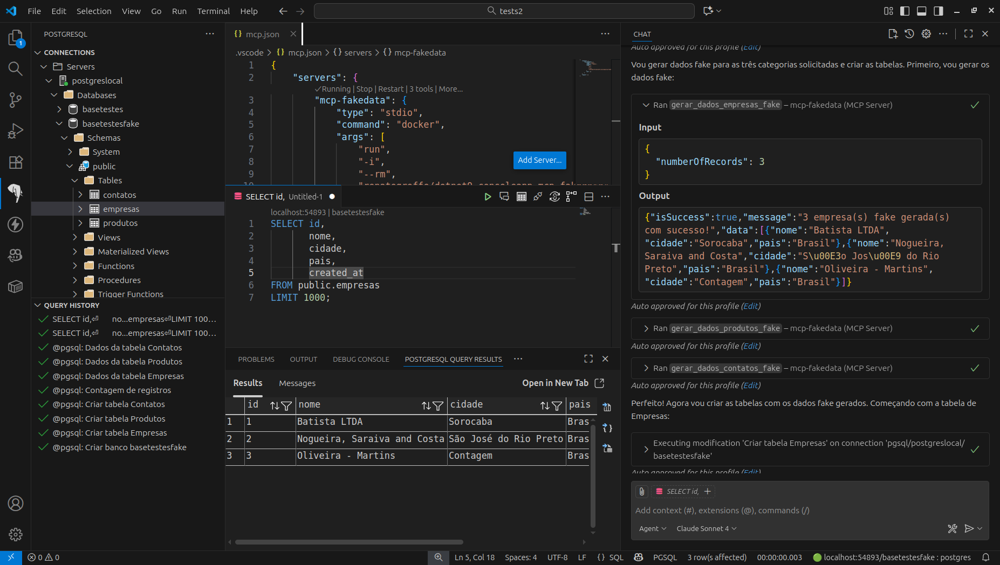

# dotnet9-consoleapp-mcp-fakedata
Implementação em .NET 9 (Console App) de MCP Server (stdio) para a geração de dados fake de empresas, contatos e produtos no padrão brasileiro. Inclui o uso da biblioteca Bogus e de um Dockerfile para build de imagens da aplicação.

Imagem para uso do MCP de dados fake - **renatogroffe/dotnet9-consoleapp-mcp-fakedata**:

https://hub.docker.com/r/renatogroffe/dotnet9-consoleapp-mcp-fakedata/tags

Testes com o MCP No Visual Studio Code:

